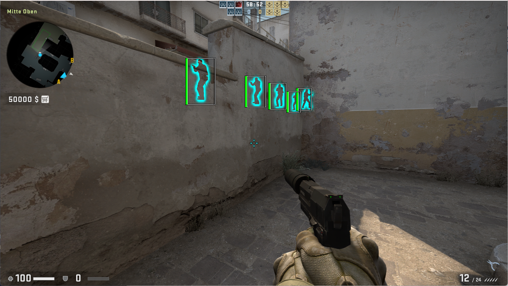
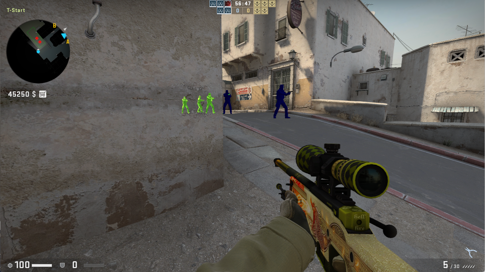

# CS:GO Cheat Client

<h3 align="center">

</h3>

## About
This is an internal CS:GO client designed specifically for Windows, requiring DirectX9. If you're interested in CS2, you can check out my client [here](https://github.com/avezzu/internal-cs2-client). The client features a simple GUI and includes various cheats.

## Cheats
The client incorporates the following cheats:

### Aim
- [x] TriggerBot
- [x] AimBot
- [x] SilentAimBot
- [x] RecoilControl

### Visuals
- [x] AntiFlash
- [x] GlowESP
- [x] BoxESP
- [x] SkeletonESP
- [x] Chams
- [x] SnapLine
- [x] FOV Changer

### Misc
- [x] Bhop
- [x] Radar
- [x] SkinChanger

## Usage
Enter a game and choose a team. Utilize ManualMapping for injecting the client and simply press the **INSERT** key to open the Menu. To remove the client, press the **END** key.

## Dependencies
- [minhook](https://github.com/TsudaKageyu/minhook/tree/master) - function hooking
- [imgui](https://github.com/ocornut/imgui) - gui
- [STB](https://github.com/cristeigabriel/STB) - signatures
- [based](https://github.com/cazzwastaken/based) - cs:go interfaces

